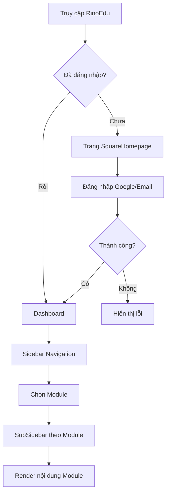
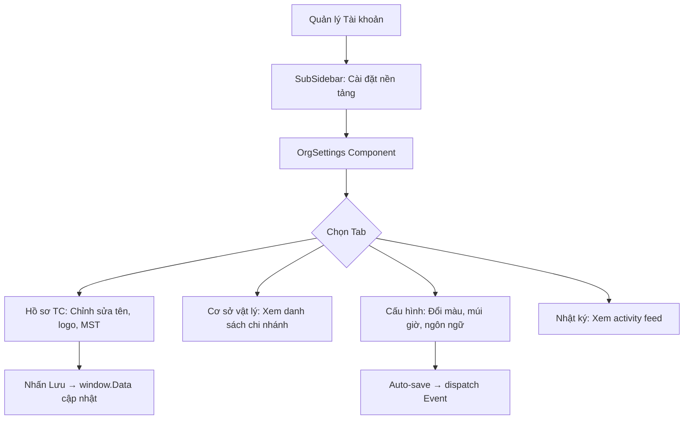
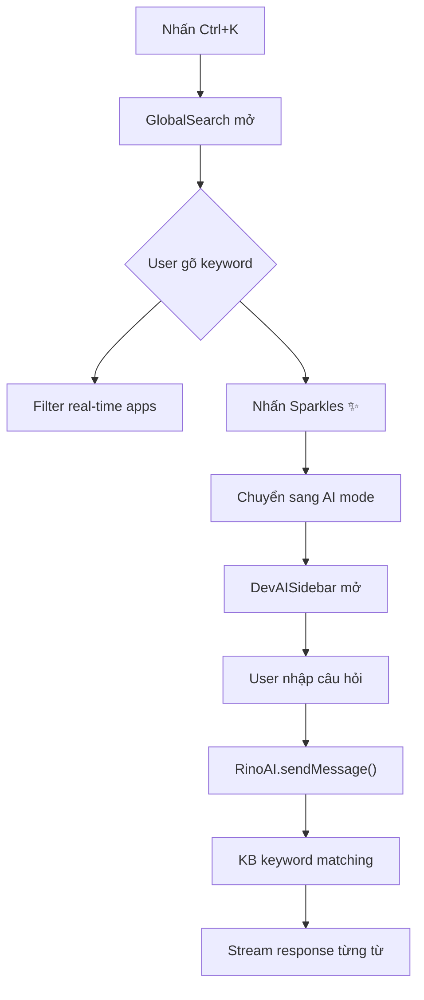

# Sách Trắng Kiến trúc RinoEdu (Architecture Whitepaper)
*Bản Cập nhật Chính thức v2.0 — Dành cho Đội Phát triển, AI Factory & Trợ lý AI*

---

## 1. TẦM NHÌN VÀ SỨ MỆNH KIẾN TRÚC
RinoEdu là một **Hệ sinh thái SaaS Enterprise** bao gồm nhiều lĩnh vực nghiệp vụ từ Giáo dục, Nhân sự, Khách hàng, Tài chính đến Kho vận. Để đáp ứng sự phình to của hệ thống trong 5-10 năm tới mà không trở thành một mớ hỗn độn (Big Ball of Mud), chúng ta áp dụng kiến trúc **Modular Monolith**.

## 2. CHUẨN MỰC MODULAR MONOLITH
Mã nguồn ứng dụng được chia thành các Khối độc lập (Modules). Mỗi Module giống như một "Vương quốc thu nhỏ" có giao diện (UI), Business Logic và Database riêng biệt.

### 2.1 Các Module Cốt lõi (Core Modules)
| # | Module | Thư mục | Trạng thái | Mô tả |
|:--|:-------|:--------|:----------:|:------|
| 1 | **iam** | `src/modules/iam/` | ✅ 6 files | Quản lý định danh, phân quyền, hồ sơ cá nhân, bảo mật, OrgSettings |
| 2 | **education** | `src/modules/education/` | 🟡 1 file | Quản lý lớp học, điểm danh, điểm số |
| 3 | **hr** | `src/modules/hr/` | 🟡 1 file | Quản lý nhân viên, chấm công, tính lương |
| 4 | **mdm** | `src/modules/mdm/` | 🟡 1 file | Kho tài sản, Cơ sở vật chất |
| 5 | **crm** | `src/modules/crm/` | ❌ Empty | Phễu bán hàng, Leads |
| 6 | **fintech** | `src/modules/fintech/` | ❌ Empty | Học phí, Thu chi, VNPAY |
| 7 | **comms** | `src/modules/comms/` | ❌ Empty | Chat, Email, SMS |
| 8 | **logistics** | `src/modules/logistics/` | ❌ Empty | Vận chuyển tài liệu |

### 2.2 Ba (3) Luật Sống còn của Backend & Database
1. **Cấm truy vấn chéo (No Cross-DB Queries):** Bảng mỗi module mang tiền tố riêng (`iam_users`, `crm_leads`).
2. **Giao tiếp qua DTOs:** Module gọi nhau qua HTTP/RPC API nội bộ, không truy vấn trực tiếp DB.
3. **API Contract:** FE phải sử dụng Interface/DTO chuẩn đặt tại `src/shared/interfaces/`.

## 3. HẠ TẦNG FRONTEND & TÍNH NĂNG LÕI (CORE FOUNDATION)

### 3.1 Các Trụ cột Kỹ thuật
| Trụ cột | File | Mô tả |
|:--------|:-----|:------|
| **i18n** | `src/utils/i18n.js` | Đa ngôn ngữ Vi/En, chuyển đổi real-time qua `window.setLanguage()` |
| **Formatters** | `src/utils/formatters.js` | Format tiền (VND/USD), ngày (DD/MM/YYYY). Cấm hardcode |
| **Design Tokens** | `src/shared/design-tokens.css` | Biến CSS: `--color-brand`, `--color-success`. Cấm dùng mã HEX cứng |
| **Icons** | `src/utils/icons.jsx` | 135+ icon Lucide, truy cập qua `window.Icons.TênIcon` |
| **Mock Data** | `src/utils/data.jsx` | Dữ liệu mẫu toàn hệ thống, 50+ apps, 5 lớp, 3 GV, 4 chi nhánh |
| **Error Interceptor** | `src/api/client.js` | Tự bơm JWT, xử lý 401/403/500 |

### 3.2 Các Component Dùng chung
| Component | File | Chức năng chính |
|:----------|:-----|:----------------|
| **Header** | `src/components/Header.jsx` | Breadcrumb, Search trigger, Notifications, Avatar |
| **Sidebar** | `src/components/Sidebar.jsx` | Navigation chính, collapse/expand, icon-only mode |
| **SubSidebar** | `src/components/SubSidebar.jsx` | Menu phụ theo module đang active |
| **AppLauncher** | `src/components/AppLauncher.jsx` | Grid apps, Drag & Drop reorder, Category filter |
| **GlobalSearch** | `src/components/GlobalSearch.jsx` | Ctrl+K, real-time filter, AI mode toggle |
| **UserMenu** | `src/components/UserMenu.jsx` | Workspace switcher, Dark mode, Logout |
| **NotificationBell** | `src/components/common/NotificationBell.jsx` | SSE mock, badge count, mark-all-read |
| **DevAISidebar** | `src/components/DevAISidebar.jsx` | Chat AI panel, Markdown render, Code highlight |

### 3.3 Giao diện Trang Chủ (SquareHomepage)
Component chính: `src/pages/SquareHomepage.jsx` (URL: `#/home`)
Trang chủ RinoEdu được thiết kế theo phong cách tối giản, tập trung vào tìm kiếm và AI:
- **Header:** Chứa Logo, nút App Launcher (dạng lưới), nút "Dashboard", và Avatar người dùng (hoặc nút Đăng nhập).
- **Banner Trung tâm:** Logo tia chớp với dòng chữ lớn "RinoEdu - Nền tảng quản lý giáo dục thông minh".
- **Thanh Tìm kiếm Toàn năng (Universal Search):** Nằm ngay giữa màn hình ("Tìm kiếm toàn bộ hệ thống..."), đi kèm với nút "Hỏi AI" (biểu tượng Sparkles). Khi user nhập liệu hoặc nhấn Hỏi AI, giao diện sẽ mở rộng để tương tác với RinoEdu AI.
- **Truy cập nhanh (Quick Access):** Danh sách các module phổ biến nằm ngay dưới thanh tìm kiếm, bao gồm: `Đào tạo`, `Nhân sự`, `CRM`, `Kho tài sản`, `Quản lý tài khoản`.
- **Kho AI & Tài nguyên (Warehouse):** Quản lý tài liệu và các file được dùng cho Agent AI.
- **Code Canvas:** Vùng hiển thị code/preview khi đang ở chế độ Coding Mode với AI.

### 3.4 Giao diện Dashboard (Không gian làm việc)
Component chính: `src/pages/Dashboard.jsx` (URL: `#/dashboard`)
Dashboard là màn hình làm việc chính sau khi đăng nhập, bao gồm:
- **Thẻ Chào hỏi (Greeting Card):** Câu chào "Chào buổi sáng/chiều/tối, [Tên user]!" kèm ô nhập "Tâm điểm hôm nay" để user ghi mục tiêu chính trong ngày.
- **Widget Thời tiết:** Card thời tiết gradient tím (Hà Nội, nhiệt độ, ngày/giờ hiện tại).
- **Truy cập nhanh (Quick Access):** Lưới các ứng dụng shortcut (cấu hình được) + nút "Thêm mới".
- **KPI Widgets (Chỉ số quan trọng):**
  - Số dư ví (15.000.000 VNĐ)
  - Task cần làm (số lượng + canh báo quá hạn)
  - Dự án active (đang chạy + deadline)
- **Chờ phê duyệt (Pending Approvals):** Card gradient cam-đỏ hiển thị số phiếu chờ duyệt (Nghỉ phép, PO, Tạm ứng) + nút "Xử lý ngay".
- **Hoạt động cá nhân (Activity Feed):** Timeline các hành động gần đây của user (duyệt PO, meeting, cập nhật hồ sơ...) + nút "Xem tất cả".

---

## 4. HƯỚNG DẪN TÍNH NĂNG CHI TIẾT (USER GUIDE)

### 4.1 Hệ thống Điều hướng Thông minh (Smart Navigation)

**Universal Search (Cmd/Ctrl + K):**
- Mở bằng phím tắt `Ctrl+K` hoặc click vào thanh search trên Header
- Tìm kiếm real-time: gõ tên app → kết quả lọc tức thì
- Dùng phím ↑↓ để di chuyển giữa kết quả, Enter để chọn, ESC để đóng
- Tab "AI mode" (biểu tượng Sparkles ✨) → chuyển sang hỏi AI trợ lý

**App Launcher:**
- Click biểu tượng Grid (⊞) trên Sidebar → mở danh sách tất cả ứng dụng
- Sidebar bên trái: lọc theo danh mục (Hệ thống, Tổ chức, Giảng dạy...)
- Tab lọc bên trên: lọc nhanh theo loại service
- **Drag & Drop:** Kéo thả icon app để sắp xếp lại thứ tự ưu tiên
- Mỗi app card hiển thị: Tên, Mô tả, Giá, Nút "Mở"

**Shortcuts Guide:**
- Nhấn phím `?` bất cứ lúc nào → mở bảng phím tắt toàn hệ thống
- Các phím tắt chính: `Ctrl+K` (Search), `?` (Guide), `Ctrl+B` (Sidebar toggle)

### 4.2 Quản trị Tổ chức (Organization Management)
Truy cập: **Quản lý tài khoản** → Sidebar trái → **Cài đặt nền tảng**

| Tab | Chức năng | Thao tác chính |
|:----|:----------|:---------------|
| **Hồ sơ Tổ chức** | Tên, logo, website, MST, GPKD | Chỉnh sửa trực tiếp → Nhấn "Lưu" |
| **Cơ sở vật lý** | Danh sách chi nhánh, địa chỉ, quản lý | Xem, tìm kiếm, lọc theo trạng thái |
| **Cấu hình vận hành** | Múi giờ, Ngôn ngữ, Theme Color | Chọn từ dropdown → Auto-save |
| **Nhật ký thay đổi** | Log nội bộ module Tổ chức | Xem timeline, lọc theo loại hành động |

### 4.3 Quản lý Tài khoản Cá nhân (Account Management)
Truy cập: Sidebar → **Quản lý tài khoản** hoặc Avatar → Menu

| Tab | Chức năng | Thao tác chính |
|:----|:----------|:---------------|
| **Hồ sơ cá nhân** | Tên, email, avatar, vị trí | Cập nhật → Lưu |
| **Bảo mật & Liên kết** | 2FA, đổi mật khẩu, thiết bị | Bật/tắt 2FA, Revoke thiết bị |
| **Cài đặt chung** | Dark Mode, Ngôn ngữ, Múi giờ | Toggle/Dropdown |

### 4.4 Quản trị Hệ thống (System Admin)
Truy cập: **Quản lý tài khoản** → nhóm "Quản trị Hệ thống"

| Tab | Chức năng | Thao tác chính |
|:----|:----------|:---------------|
| **Người dùng HT** | Danh sách user, vai trò, trạng thái | Thêm/Sửa/Khóa user |
| **Nhật ký HT (Audit)** | Log XÓA/SỬA/THÊM/TỰ ĐỘNG | Tìm kiếm, Lọc theo ngày, Xuất báo cáo |
| **Webhooks** | Tích hợp bên thứ 3 (Zalo, SMS, VNPAY) | Tạo/Sửa/Tạm dừng webhook |

### 4.5 Thông báo (Notifications)
- **Badge đỏ** trên icon chuông = có thông báo chưa đọc
- Click chuông → dropdown với danh sách thông báo
- Nút "Đánh dấu đã đọc" → mark tất cả là đã đọc
- Sau 10 giây kể từ khi mở app, hệ thống mô phỏng nhận thông báo mới (SSE mock)
- Nút "Xem tất cả" → điều hướng đến trang Thông báo đầy đủ

### 4.6 AI Trợ lý (RinoEdu AI)
- Truy cập qua nút chat (⚡) ở góc phải hoặc từ Global Search → AI mode
- AI hiểu về: Học viên, Lớp học, Giáo viên, Học phí, Điểm danh, Cài đặt, Dashboard
- Có thể thực hiện **Quick Actions**: mở ứng dụng, đổi theme, xem danh sách chi nhánh
- AI stream câu trả lời từng từ (typing effect) cho trải nghiệm tự nhiên
- Hỗ trợ render Markdown: bold, italic, danh sách, code blocks

---

## 5. API SCHEMA REFERENCE (MOCK DATA)

### 5.1 Cấu trúc Ứng dụng (`ALL_APP_LIBRARY`)
```javascript
{
  id: 'app_id',         // Unique key
  name: 'Tên hiển thị', // Vietnamese app name
  icon: Component,      // Lucide React icon component
  color: 'text-xxx',    // Tailwind color class
  category: 'Danh mục', // Filter category
  desc: 'Mô tả',       // Short description
  price: 'Free|Pro'     // Pricing tier
}
```

### 5.2 Cấu trúc Chi nhánh (`BRANCH_LIST_DETAILED`)
```javascript
{
  id: 'b1',
  name: 'Trụ sở Cầu Giấy',
  code: 'HN-CG',            // Branch code
  address: 'Địa chỉ đầy đủ',
  maps: 'Google Maps URL',
  manager: 'Tên quản lý',
  phone: '024 xxxx xxxx',
  status: 'Hoạt động|Bảo trì',
  type: 'Trụ sở chính|Chi nhánh vệ tinh',
  rooms: 12,                 // Số phòng học
  operatingHours: '08:00 - 21:00'
}
```

### 5.3 Cấu trúc Thông báo (`NOTIFICATIONS_MOCK`)
```javascript
{
  id: 1,
  type: 'approval|meeting|system|chat',
  title: 'Tiêu đề',
  desc: 'Nội dung chi tiết',
  time: 'Thời gian tương đối',
  read: false,
  priority: 'high|medium|low',
  group: 'today|yesterday',
  actionable: true,          // Có nút Approve/Reject
  status: 'pending|approved'
}
```

### 5.4 Cấu trúc Lớp học (`MOCK_CLASSES`)
```javascript
{
  id: 'c1',
  name: 'Toán Cao Cấp - K12',
  course: 'Đại số tuyến tính',
  code: 'MATH101',
  students: 35,
  schedule: 'T2, T4 (08:00 - 10:00)',
  progress: 45,              // Phần trăm hoàn thành
  status: 'Đang diễn ra|Sắp bắt đầu|Đã kết thúc',
  room: 'Phòng 301',
  color: 'blue'              // Theme color
}
```

### 5.5 Cấu trúc Tài khoản Tab (`ACCOUNT_TABS`)
```javascript
{
  id: 'profile',
  label: 'Hồ sơ cá nhân',
  iconName: 'IdCard',       // String → window.Icons[iconName]
  category: 'Tài khoản|Quản lý Nền tảng|Quản trị Hệ thống'
}
```

---

## 6. USER FLOW DIAGRAMS

### 6.1 Luồng Đăng nhập & Điều hướng


### 6.2 Luồng Quản lý Tổ chức


### 6.3 Luồng Tìm kiếm & AI


---

## 7. CHIẾN LƯỢC RINOEDU AI (AI FACTORY v2.0)

### 7.1 Kiến trúc AI Hiện tại
```
┌─────────────────────────────────────────────┐
│  Frontend (DevAISidebar.jsx)                │
│  ├── Input → RinoAI.sendMessage()           │
│  ├── Streaming response (word-by-word)      │
│  └── Markdown render + Code highlight       │
├─────────────────────────────────────────────┤
│  AI Engine (src/api/ai.js)                  │
│  ├── Knowledge Base: 12 Q&A categories      │
│  ├── Keyword matching: toLowerCase + includes│
│  ├── Fallback responses: 5 generic answers  │
│  └── Quick Actions: navigate, theme, data   │
├─────────────────────────────────────────────┤
│  Cloudflare Workers (rino)                 │
│  └── LLM endpoint cho production            │
└─────────────────────────────────────────────┘
```

### 7.2 Knowledge Base Categories
AI hiện biết trả lời về: Giới thiệu bản thân, Học viên, Lớp học, Giáo viên, Học phí, Báo cáo, Điểm danh, Cài đặt, Tìm kiếm, Workspace, Đăng nhập, Kho tài sản, Coding mode.

### 7.3 Tool Calling (Quick Actions)
AI có thể thực hiện các hành động thực trên nền tảng:
- `navigate(moduleId)` — Mở module/app bất kỳ
- `toggleTheme()` — Chuyển đổi Dark/Light mode
- `getData(key)` — Trả về dữ liệu thực từ `window.Data`
- `openBranch(branchId)` — Mở chi tiết chi nhánh trong OrgSettings

### 7.4 AI Factory (Dành cho Developer)
RinoEdu AI Factory gồm 7 Agents chạy CrewAI Python:
- **`pm`**: Product Manager — phân tích yêu cầu, lập kế hoạch sprint
- **`ui`**: UI Designer — thiết kế giao diện, chọn color palette
- **`be`**: Backend Engineer — viết API, database schema
- **`fe`**: Frontend Engineer — viết React component, CSS
- **`review`**: Code Reviewer — kiểm tra chất lượng code
- **`test`**: QA Tester — viết test case, kiểm thử
- **`doc`**: Technical Writer — viết documentation, user guide

Các Agents đọc Whitepaper này và tự động sinh code React/Mock Server chính xác cho Human Developer duyệt.

---

## 8. LƯU Ý CHO DEVELOPER & AI AGENTS
- **Mock Data:** Toàn bộ nằm tại `src/utils/data.jsx`. IIFE wrapping để tránh global pollution.
- **Icon:** Dùng `window.Icons.TênIcon`. TUYỆT ĐỐI không tạo biến `Map` ở global scope (trùng `window.Map`).
- **Reactivity:** Khi thay đổi `OrgSettings`, dispatch `org-data-updated` event.
- **Routing:** Hash-based (`#/module_id`). Không dùng HTML5 History API với Live Server.
- **i18n:** File `.js` (không phải `.jsx`). Truy cập qua `window.i18n.t('key')`.

---
*RinoEdu - Modern Education OS — Whitepaper v2.0*
